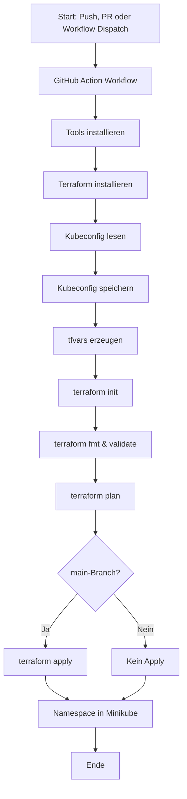
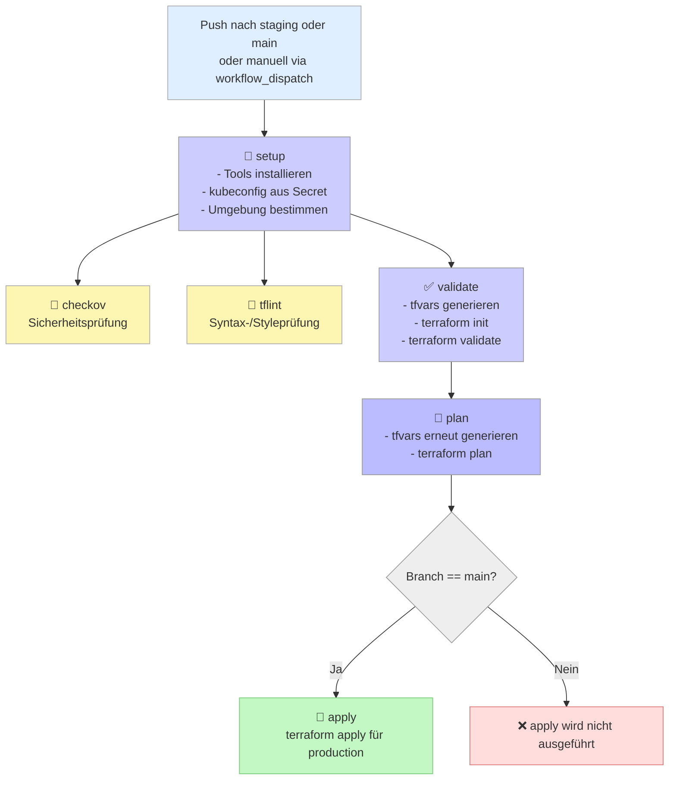

```mermaid
graph TD
  A[Start: Push, PR oder Workflow Dispatch] --> B[GitHub Action Workflow]
  B --> C[Tools installieren]
  C --> D[Terraform installieren]
  D --> E[Kubeconfig lesen]
  E --> F[Kubeconfig speichern]
  F --> G[tfvars erzeugen]
  G --> H[terraform init]
  H --> I[terraform fmt & validate]
  I --> J[terraform plan]
  J --> K{main-Branch?}
  K -- Ja --> L[terraform apply]
  K -- Nein --> M[Kein Apply]
  L --> N[Namespace in Minikube]
  M --> N
  N --> O[Ende]

```

```mermaid

flowchart TD
    A[Push nach staging oder main<br>oder manuell via workflow_dispatch] --> B[🧰 setup<br>- Tools installieren<br>- kubeconfig aus Secret<br>- Umgebung bestimmen]

    B --> C[🔐 checkov<br>Sicherheitsprüfung]
    B --> D[🧹 tflint<br>Syntax-/Styleprüfung]

    B --> E[✅ validate<br>- tfvars generieren<br>- terraform init<br>- terraform validate]

    E --> F[📐 plan<br>- tfvars erneut generieren<br>- terraform plan]

    F --> G{Branch == main?}
    G -- Ja --> H[🚀 apply<br>terraform apply für production]
    G -- Nein --> I[❌ apply wird nicht ausgeführt]

    style A fill:#dfefff,stroke:#aaa
    style B fill:#ccf,stroke:#999
    style C fill:#fdf6b2,stroke:#aaa
    style D fill:#fdf6b2,stroke:#aaa
    style E fill:#ccf,stroke:#999
    style F fill:#bbf,stroke:#999
    style G fill:#eee,stroke:#999
    style H fill:#c3f7c3,stroke:#7c7
    style I fill:#fdd,stroke:#d77


```