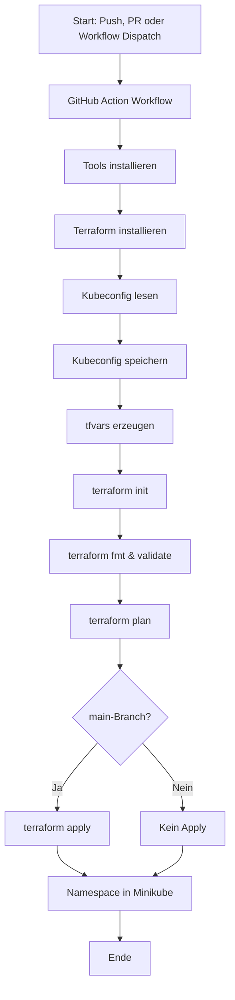

```mermaid
graph TD
  A[Start: Push, PR oder Workflow Dispatch] --> B[GitHub Action Workflow]
  B --> C[Tools installieren]
  C --> D[Terraform installieren]
  D --> E[Kubeconfig lesen]
  E --> F[Kubeconfig speichern]
  F --> G[tfvars erzeugen]
  G --> H[terraform init]
  H --> I[terraform fmt & validate]
  I --> J[terraform plan]
  J --> K{main-Branch?}
  K -- Ja --> L[terraform apply]
  K -- Nein --> M[Kein Apply]
  L --> N[Namespace in Minikube]
  M --> N
  N --> O[Ende]

```