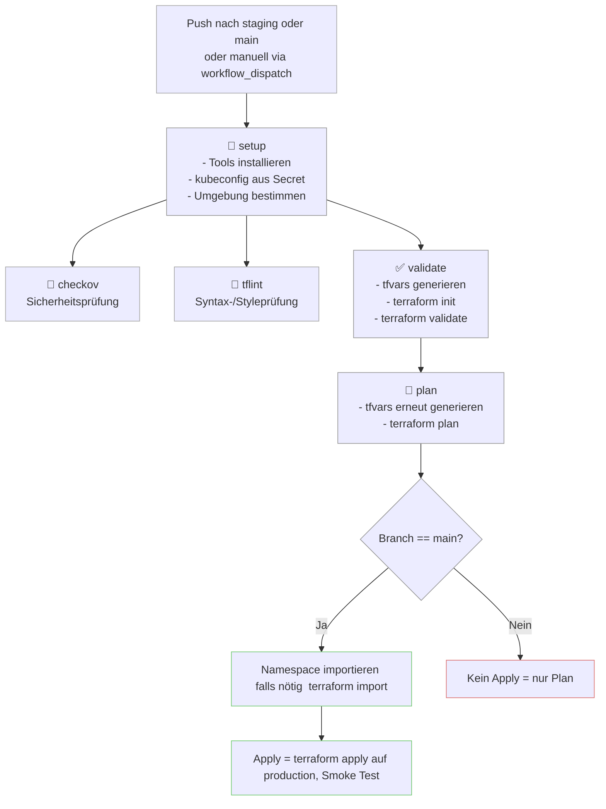

# iac-cicd-k8s-namespace

**CI/CD-Pipeline für das Deployment eines Kubernetes Namespace via Terraform auf einem Minikube-Cluster**  
Dieses Projekt implementiert Infrastructure-as-Code (IaC) mit GitHub Actions, Terraform und Kubernetes (Minikube) in einer produktionsnahen Umgebung. Es zeigt einen vollständigen CI/CD-Workflow für Kubernetes-IaC – lokal entwickelbar, teamtauglich und leicht erweiterbar.

---

## 🔧 Tech Stack

- **Terraform** – Infrastruktur als Code
- **GitHub Actions** – Automatisierte CI/CD Workflows
- **Kubernetes (Minikube)** – Zielumgebung
- **Checkov** – Sicherheitsprüfung der Terraform-Konfiguration
- **TFLint** – Linter für Terraform
- **GitHub Secrets** – Speicherung der Base64-kodierten Kubeconfig

---
## 📁 GitHub Branch-Strategie

- **main für Produktion:** -Führt zu Terraform Apply auf Namespace in PROD.
- **staging für Entwicklung**  
---
## 📁 Projektstruktur

```bash
terraform/
├── main.tf                # Provider-Definition & Terraform-Setup
├── namespace.tf           # Kubernetes Namespace Resource
├── variables.tf           # Input-Variablen
└── environments/
    ├── staging.tfvars     # Staging-Konfiguration
    └── production.tfvars  # Production-Konfiguration

.github/workflows/
└── deploy.yml             # GitHub Actions Workflow für CI/CD 
```


# CI/CD-Workflow für Terraform + Kubernetes Namespace




