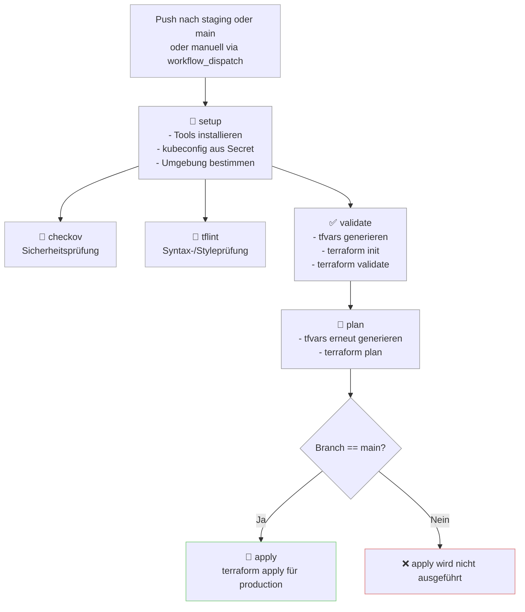

## Workflow-Diagramm

## Hinweise
.  Die KUBECONFIG wird aus einem Secret (KUBECONFIG_B64) zur Laufzeit generiert.

. terraform apply wird nur auf dem main-Branch automatisch ausgeführt.

. Die Umgebung staging dient rein zu Testzwecken (Plan & Validate).