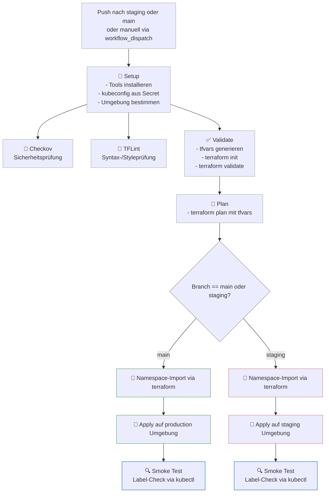

# CI/CD-Workflow für Terraform + Kubernetes Namespace

```mermaid

flowchart TD
    A[Push nach staging oder main\noder manuell via workflow_dispatch] --> B[🧰 Setup\n- Tools installieren\n- kubeconfig aus Secret\n- Umgebung bestimmen]
    

    B --> C[🔐 Checkov\nSicherheitsprüfung]
    B --> D[🧹 TFLint\nSyntax-/Styleprüfung]
    B --> E[✅ Validate\n- tfvars generieren\n- terraform init\n- terraform validate]

    E --> F[📐 Plan\n- terraform plan mit tfvars]

    F --> G{Branch == main oder staging?}

    G -- main --> H[🧩 Namespace-Import via terraform]
    H --> I[🚀 Apply auf production Umgebung]
    I --> K[🔍 Smoke Test\nLabel-Check via kubectl]

    G -- staging --> J[ 🧩 Namespace-Import via terraform]
    J --> R[🚀 Apply auf staging Umgebung]

    R --> L[🔍 Smoke Test\nLabel-Check via kubectl]

    style A fill:#,stroke:#aaa
    style B fill:#,stroke:#aaa
    style C fill:#,stroke:#aaa
    style D fill:#,stroke:#aaa
    style E fill:#,stroke:#aaa
    style F fill:#,stroke:#aaa
    style G fill:#,stroke:#888
    style H fill:#,stroke:#4a4
    style I fill:#,stroke:#4a4
    style K fill:#,stroke:#06b
    style J fill:#,stroke:#d77
    style R fill:#,stroke:#d77
    style L fill:#,stroke:#06b


```
